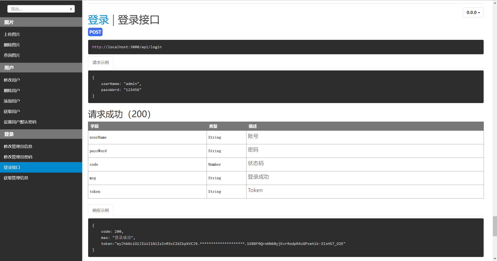

# Vue3 + Express + MySQL

#### 介绍
```
入门级别的 Vue3 + Express + MySQL的结合，
使用Express 框架实现了Api接口，
使用vue3作为ui框架。
```

#### 软件架构
1. node 文件夹存放的是 Express 源码
2. vue 文件夹存放的是 vue3 源码
3. nodejs.sql 数据库文件
4. Node版本 20.10.0
5. 接口文档使用(morgan)
```
修改文档后执行：apidoc -i. -o apidoc4. apidoc -i. -o apidoc
```
#### 安装教程 --> 后端安装启动
1.  将 nodejs.sql 导入数据库
2.  下载node包指令 （npm install 或 npm i）
3.  运行node包 （npm run start）


#### 安装教程 --> 前端安装启动
1.  下载vue包指令 （npm install 或 npm i）
2.  启动 （npm run dev）

#### 使用说明
```
登录账号：admin
登录密码：123456
```
接口文档：http://localhost:3000/apidoc (后端运行后)



